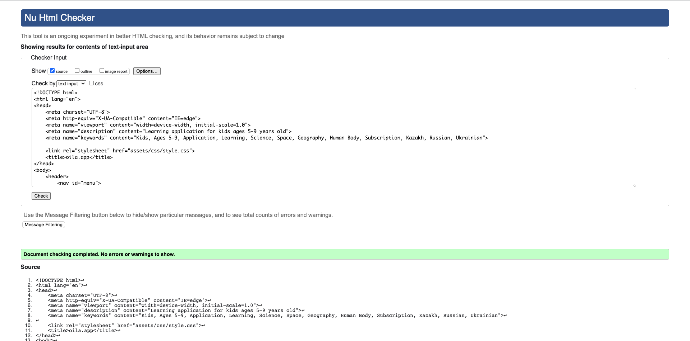

# OILA.app
This is a childrens learning app ages 5-9. The company/ startup is based in Astana, Kazakhstan and is avaliable in Russian, Ukrainian, and Kazakh. OILA aims to mix play and learning together in one app that can be used independtly by children. This website hopes to present clear and concise information about the functionality and benefits of the OILA application to spread awarness to the target audince.
## Table of Contents
- [User Experience (UX)](#user-experience--ux-)
- [Technologies used](#technologies-used)
- [Features](#features)
- [Testing](#testing)
- [Deployment](#deployment)
- [Credits](#credits)
## User Experience (UX)

### User stories

#### First Time Visitor Goals
- First time visitors should have a fast understanding what the goal of the organisation is. 
- First time visitors need to get the information about who the services are for. 
- First time users should have the ability to find our social media links to get more information. 
- First time users should have the ability to download the application on both app stores.
#### Returning Visitor Goals
- Returning users should be able to go to navigate quickly to sections of the page.
- Returning users can find the link to the application on the page. 
- Returning users should find the links to follow us on social media 
### Design 
For the design I was given a shade of yellow, purple, white, and light blue. These colors serve to compliment the playful and simple shade of yellow in the application. These colors also seperate each section of the main page. The custom font and images are meant to be simple and familiy oriented to attract the desired audince 
1. Images
The hero image was selected to communicate directly what the service provided and the target audince of parents and children 9-5 years old.
2. Colour Scheme
The colors were used to seperate sections of the website and to match the application's color template

3. Typography
The custom font was taken from the application itself which is meant to represent the applications purpose which is to help kids learn through play.
## Technologies used 

### languages
- CSS
- HTML

### Frameworks, Libraries & Programs Used
- [font awesome](https://fontawesome.com/): all the icons on this webpage are from Font awesome
- Git: Git was use commit and push to github 
- [GitPod](https://gitpod.io/): Gitpod was used as development environment 
- [GitHub](https://github.com/): Github was used to deploy the site and store it 
## Features
### Navigation Bar
The navigation bar stays at the top of the screen while scrolling and when the words are clicked it will take the user to the certain section.

### Hero image and text
The hero image is meant to indicate the user that it is an application meant for children to learn and play. 

The children in the image on the tablet shows that it is an application for kids that is fun. Directly under the image it indicates the age range and that is an educational app.

### What we do

The section after the hero image lists several features and benefits of the application which highlights all the topics listed, languages avaliable, and fun independent learning for children.

### Footer
In the footer the contact information of the company is listed as well as links to the privacy policy and the EULA Terms. Users can contact the organization for any unanswered questions.

## Testing 
## Testing of the user story
### User stories
|Goal| Execution|
|--------------------------------------------------------------------------------------|-------------------------------------------------------|
|First time visitors should have an fast understanding of the goal of the organisation| The hero image and the small description underneath|
|First time visitors need to get the information about who the services are for.| Information in description under hero image and on promo video|
|First time users should have the ability to find our social media links to get more information.| Social media links under astana-hub video|
|First time users should have the ability to download the application on both app stores.| Download buttons that interact when hovered on|
|Returning users should be able to go to navigate quickly to sections of the page.| Section names on navigation bar that take you to section when clicked|
|Returning users can find the link to the application on the page.| App store link buttons for both apple and google|
|Returning users should find the links to folow us on social media.| Social media links under the astana hub video.|
## Manual code testing
### Responsiveness
The website is adapted to be seen on different screen sizes. 
The responsiveness of the website was first tested by chrome developer tools. 
Different breakpoints where used to view the website. 
Next to this the website was viewed on different devices: laptop, tablet and smartphones.
### Browser compatibility
The website was tested in different browsers. 

|Browser| compatibility|
|------------------------------------|-------------|
|Mozilla Firefox versie 102.0|no problems|
|Microsoft Edge Versie 103.0.1264.44|no problems|
|Google Chrome Versie 103.0.5060.114 | no problems|

### Validator Testing
1. HTML

2. CSS

### Fixed bugs
- The size of the testimonials were of varying size. Fixed by targeting individual image and correcting width and height
- An image from the testimonials didn't fit when the screen size was reduced. Fixed by setting up media quieres to adjust margin and size at different sizes. 
### Unfixed bugs
- footer element over extends at the bottom when the size of the page is made smaller. The location of the bug hasn't been found.
## Deployment
This site was deployed by GitHub pages. 

To deploy a page you first go to the GitHub repository, then you go to setting. 
Afterwards you go to the subsection pages. 
Next go to the source section and select Branch:main. 
Press save and then you receive a link.  

Live link: https://simonepietraroia.github.io/OILA.app/
## Credits

### Images
- All images were created and provided by the OILA organization
- 1st testimonial headshot stock photo found at [image] (https://www.pexels.com/photo/woman-standing-near-whiteboard-1181519/)
- 2nd testimonial headshot stock photo found at [image] (https://www.pexels.com/photo/woman-wearing-gray-notch-lapel-suit-jacket-2381069/)
- 3rd testimonial headshot stock photo found at [image] (https://www.pexels.com/photo/man-in-red-button-up-shirt-3777943/)

### Videos 
- 1st video in 'why join us?' section was taken from OILA youtube channel [video] (https://youtu.be/u0blbobbBhU)

- 2nd video in 'about us?' section was taken from OILA youtube channel [video] (https://youtu.be/pjtfJi3-0LA)
### code 
- The diagram in the 'why join us?' section was taken from the Love Running project by Code Institute and modified to create a similar effect 
- The social media icons section was taken from the Love Running project by Code Institute and altered.
- [w3schools](https://www.w3schools.com/) was used a lot to find additional information and codes for a variety of problems encountered